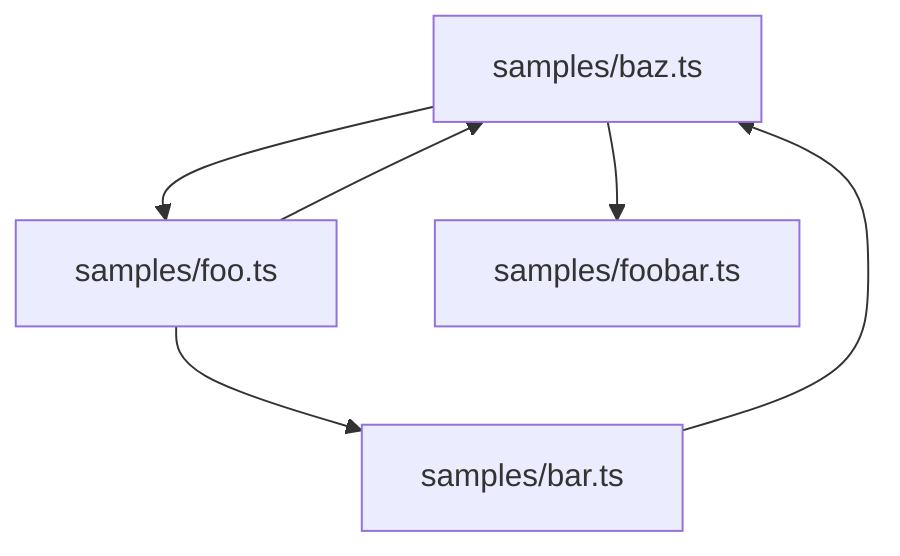
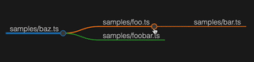

# archaste

Using typescript compiler to discover what your typescript code does.

## Problem this tool tries to solve

I'm currently dealing with a quite large typescript codebase, deployed to hundreds of cloud functions, all accessing lots of services and databases.

I'd like to build a mapping of functions and what they are accessing (what tables / collections, what services).


## Ideas

This tool uses the typescript compiler to analyze the code, and hopefully solve the problem. (This is probably not the best of ideas, but it's fun )

## Current State

For now, the tool offers you a way to generate the import tree from a single typescript source file.

### Example

The `samples` directory contains a bunch of files from which a mermaid import tree can be generated



or a [MarkMap](https://markmap.js.org/):



### MarkMap

Generate a [MarkMap](https://markmap.js.org/) compatible markdown file using the following command:

```bash
npm run --silent main <path-to-file> -- --markmap
```

This will write to standard output a markmap compatible markdown file.

### Mermaid

Generate a markdown compatible [Mermaid](https://mermaid-js.github.io/mermaid/#/) graph using this command:

```bash
npm run --silent main <path-to-file> -- --mermaid
```

This will write to standard output a mermaid compatible markdown file.

### D3.js

The `sites` directory contains the webpage for rendering the tree. For now, the tree is materialized in a json file named `tree.json`.

To generate this json, run

```bash
npm run --silent main <path-to-file> -- --importJson
```

This will write a json file to standard output, which you can redirect to `sites/tree.json` file.

Then, run

```bash
npx http-server sites
```

and access the webpage at `http://127.0.0.1:8080`

## Next steps

- [ ] backend - implement function call tree
- [ ] make main executable a decent cli (probably using [commander](https://www.npmjs.com/package/commander))
  - [ ] import tree: currently, edges are read "imports" but could be nice to have the user choose the direction (imports, imported by)

## Resources

Things I used to build this tool:

[1] https://github.com/microsoft/TypeScript/wiki/Using-the-Compiler-API#traversing-the-ast-with-a-little-linter

[2] https://learning-notes.mistermicheels.com/javascript/typescript/compiler-api/

[3] https://ts-ast-viewer.com/#
